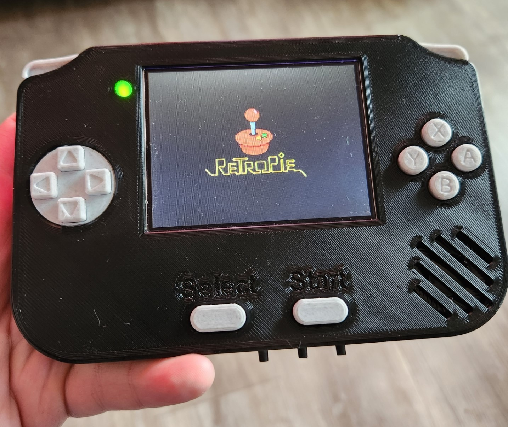
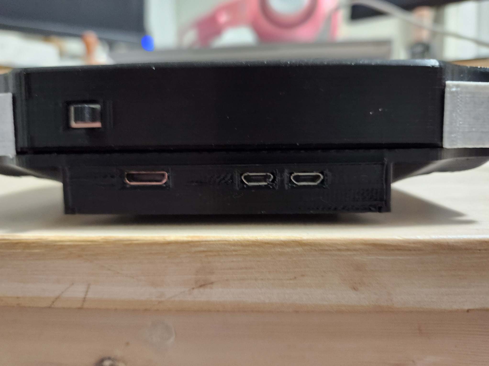
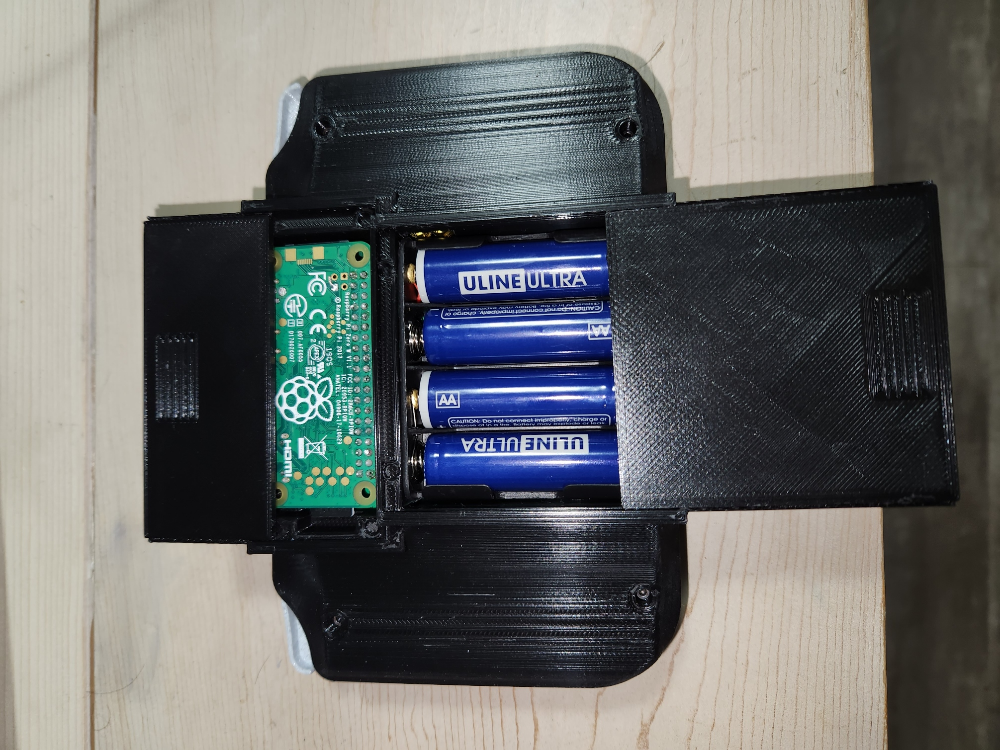

# GamePi
The GamePi is a handheld retro gaming console computed by a Raspberry Pi Zero W.

## Goals

There are two main goals of the GamePi project:

1. Design a portable handheld retro gaming console that can support targeted retro console emulators with full interface capabilities.
    - NES, Sega Genesis, SNES, Gameboy, Gameboy Colour, Gameboy Advance
    - Sufficient buttons (Direction Pad, A, B, X, Y, R/L bumpers, Start, Select) and audio
2. Use as many already-owned components as possible
    - Keep cost to a minimum
    - Current revision is to serve as a prototype to be improved upon over time

## Design and Features
Feature Keynotes:
- 3.5 inch LCD screen
- Display settings interface
- Portable
- Mono Audio with volume control
- Raspberry Pi Zero W removability
- Removeable Battery access
- Raspberry Pi Zero W port access

  
  

The console incorporates a PCB designed using Altium and an enclosure and buttons designed using Fusion 360. To display the retro video games, the GamePi uses a 3.5 inch LCD display, accompanied with three buttons to adjust display settings. While the device achieves its portability by incorporating an on board AA battery design, it can also be powered externally via a micro USB connection. The GamePi provides mono audio with a slot in the enclosure for a volume adjustment wheel. The enclosure also has two removable covers at the rear of the device: one to provide access to the AA batteries, and the other to allow access to the Raspberry Pi Zero W. Since the Raspberry Pi Zero W connects to the PCB by plugging into a female header rail, the Pi is removable should the user wish to use the hobby computer for another purpose. The Raspberry Pi cover also has port access slots for interface convenience, allowing access to the supply micro USB, device USB, and mini-HDMI ports.

**Note:** _Some unintuitive design choices may be noticed in the PCB files. For example, the use of both axial and SMD resistors. The reason for the inconsistencies or seemingly-odd design choices stems from goal #2_ "Use as many already-owned components as possible." _Some SMD components were not owned at the time of development, so axial, radial, or other components were used for the sake of availability._
